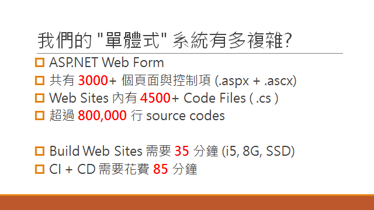
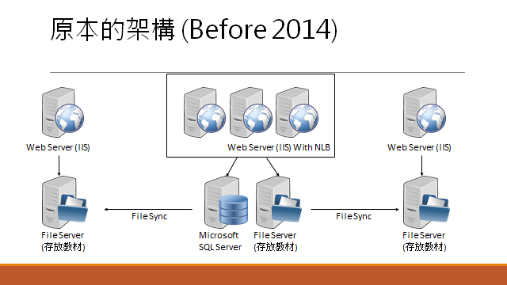

<!--more-->



--

前情提要: [架構師觀點 - 轉移到微服務架構的經驗分享 (Part 1)](/2017/04/15/microservice8-case-study/)

--

# 實際轉移案例

[上一篇](/2017/04/15/microservice8-case-study/)講到: 轉移到微服務架構是有條件的，基本門檻還達不到的話就貿然轉移到微服務
架構是很冒險的。微服務架構先天就較複雜，在開發、部署及維運這三個部份的要求都比單體式架構的 APP 來的高。因此我過去的經驗中，
我是採取比較保守的策略在做這件事。什麼叫 "保守"? 意思是我會先花很多時間研究及了解微服務架構的優缺點，也會花時間逐一進行 POC 
驗證每個改變的環節是否都能順利進行，而不是貿然的就把既有的服務整個打掉重練。

因此，我把既有的服務架構作了規劃，安排如何一步一步地進行微服務化。許多微服務化的架構建議我並沒有採用，因為我們的服務規模
還不夠大，投入在這些環節上，短時間只會造成困擾，而不會有具體的改善，這類狀況我只要確保現在的架構不會成為將來進一步改進的
阻礙就可以了。

在開始之前，先來看看我面臨的舊架構系統概況跟規模吧! 我試著盡量具體的量化 "規模" :

之前改造的服務，是人資領域相關的系統，用於數位學習及人才發展的管理。這類系統的特色就是表單特多，流程複雜。這系統的特性造成
程式碼之間的耦合度過高，維護的成本居高不下，因此降低維護的複雜度是主要目標。另外，這系統需要同時提供單機版本的
建置 (private cloud), 同時也提供雲端服務及代管模式 (SaaS, public cloud)。讓軟體架構同時適應這兩種 hosting 環境也是改版
的目標之一。

接著來看看改變之前的系統架構圖吧! 基本上就是很傳統，WEB + DB 的典型架構。其中 business logic 雖然有適當的切割 (用 library 的型態)，
但是在執行期間仍然是被放在同一個 process，部署的架構上並沒有明確的將之獨立出來。除此之外，因為系統包含數位學習，需要管理大量的
教材內容，因此多了 storage service 與 content server 的延伸架構。

各位可以想像一下，這狀況其實完全命中了微服務架構想解決的問題點啊! 這麼大規模的 code base, 改了任何一行就需要整個服務重新部署，
我們在這樣的基礎上導入了 CI / CD, 但是冗長的編譯時間也導致 CI / CD 的作用大打折扣。另外，商業邏輯也包含在 WEB 內，任何一個
模組失效 (如 out of memory exception 等等) ，都會導致整個系統掛掉...。

在當時，我歸納了整個系統架構上有四項主要的問題等著被解決:

即使如此，微服務架構仍然不是萬靈丹，因為前面有提到，微服務架構是有進入門檻與代價的啊! 經過評估之後，我們決定按照實際問題的影響程度，
逐步進行改善。對我們當時的狀況而言，最優先處理的是 **維護困難**、還有 **雲端化困難** 這兩項。而 **部署困難** 則是緊接著雲端化
問題解決後緊接著會面臨的問題，因此也一併考慮在內。因此我們著手進行微服務化架構的改進，切割的策略及進行順序都按照這重要性來安排。

回顧這決策的過程，我覺得[這篇文章: 一窩蜂驅動開發](https://blog.chunfuchao.com/?p=656&variant=zh-tw)最能描述我當時的心境了! 
這是在事後才讀到的文章，不過這篇文章講的內容完全就是我當初思考的啊! 不分享不行，我特地花了點篇幅來介紹這篇文章要講的內容...

# 一窩蜂驅動開發!!

原文: [一窩蜂驅動開發](https://blog.chunfuchao.com/?p=656&variant=zh-tw)  

我只能說，這篇文章講的實在太傳神，太到位了! 甚至文內舉了幾個常見的例子，就包含了微服務架構 XD，根本完全命中我擔心的狀況啊...

其實多看看別人的解決方案，多看看新的技術，並不是壞事。糟糕的地方在於對自己過度自信，聽到很棒的新技術就相信自己能 100% 駕馭，
不顧後果的就往前衝，往往會讓自己 (及團隊) 陷入進退兩難的困境。通常會陷入這種 "一窩蜂" 的困境的人，都有幾種特質:

1. 好奇心強，喜歡新的技術
1. 高度自信，認為自己無所不能，或是高估團隊的能力
1. 過度樂觀，缺乏替代計畫
1. 過於躁進，未做仔細評估就決定執行
1. 過於熱血，追求新技術的衝動，遠高於解決問題的企圖

其實，這幾個特色並不算是缺點，甚至很多成功的人都會有這些特質。有往前進的動力是很好的，危險的是過於衝動及躁進的態度，沒有搭配
良好的執行計畫，才是致命傷啊! 過程我就不多說，文章裡面其實已經講得很精采了 XDD，我針對主題 (導入微服務架構) 拉回來討論:

前面才說到，微服務架構的進入門檻是很高的，這點會讓過度樂觀的人更容易掉入陷阱。我如果早個五年經歷這些事情，我可能會毅然決然的
決定把整個架構砍掉重練 (Orz, 中槍)。不過現在的經驗告訴我，沒事千萬別丟掉現有的 source code 從頭改寫。舊的 code 再怎麼不堪，
至少它的邏輯是符合使用者期待的，只是可能會伴隨著很糟的效能、很差勁的可靠度... 等。用新的架構改寫，的確可以一勞永逸的解決這些問題，
不過所有的系統開發案都一樣，你終究需要一段時間，不斷的經歷測試->修正->測試... 的循環，bugs 才會逐漸下降，系統的品質才會逐步
提高到可接受的水準。砍掉重練的話這部分是很難速成的啊! 這時不論解決了多少其他問題，你的新系統終究無法立即上線，專案終究必須
度過很長的一段黑暗期... 

因此我採納了其他微服務的大師及成功案例的作法，改採 "重構" 的策略，逐步的把系統調整成微服務架構。並且在那之前，我花了不少時間，
針對我有興趣的技術，做了各種 POC 及驗證，先用最短的時間，確認這些技術真的能夠解決我們面臨的主要問題。

這正好符合這篇文章講到的幾點避免陷入一窩蜂的做法:

* 快速測試 (Spikes) - 我做了非常多的小型 POC，每個都是針對我最在意的問題，寫一段驗證的 code, 確保過程跟我想像的是一致的，真的
能解決問題才結束。以我的例子來說，對我們的系統及團隊來說，微服務化我最在意的是 API 的相容性怎麼維持? 拆解成大量服務的話怎麼
解決部署的問題? 熱門的容器化技術，是否能對我們這種 pure .net develop team 發揮功效? 過程中我甚至花了一個禮拜，把其中一個小模組
親自改寫成微服務架構 + 容器化部署，包含 web api, sdk, 以及 schedule job 等部分，都改成用 windows container + asp.net mvc
webapi 來實作。這部分的過程，我會在之後另外寫一篇文章介紹過程跟心得。

* 在投資報酬率很高的時候下手 - 書上講的 guidelines 有很多條，但是不是每條都對我的現況有幫助。我花了不少時間了解每條指引準則，
是為了解決甚麼問題? 同時檢視看看這問題是否是最困擾我們的問題? 重新思考及排序之後，我優先挑選對我們幫助最大的幾點做準備及改善。
而非清一色無腦的照著書上講的方式來進行。

* 經驗 + 有札實技術背景的人 - 這... 容我自誇一下... 哈哈，整個過程我最自豪的地方，就是過去學了那麼多 OOP，Design Patterns, 還有
一堆軟體工程的知識及技巧，終於派上用場了! 在單純專案開發，或是功能開發的階段，這些流程或是軟工領域的技能常常會被忽略，但是在碰到
這種架構層面的改變時，我過去累積的這些能力就幫了我很大的忙。

不說別的，光是重構的技巧 + 單元測試的觀念，就讓我閃開不少地雷，切割微服務的過程中順利許多。表面上我好像浪費了很多時間在做改 code
以外的事情 (如 POC，花時間先整理 Code，寫測試，同時比對新舊架構執行結果等等)，但是換來的好處是整個過程都很可靠很平穩地進行。
雖然不見得是最快速度，但是是風險最低的做法，同時過程中隨時都能維持可出貨可使用的狀態。這些都要歸功過去累積的知識及經驗。

奉勸各位 (尤其是技術決策者)，看到我寫的這系列微服務架構的文章，千萬別太興奮就想要你的團隊一頭衝進來啊! 做這種事情，最關鍵的
角色就是團隊裡要有個稱職的架構師。別過度相信 SA / SD / PM (Project Manager) / PM (Product Manager), 甚至是 senior / junior engineer
等角色能做好這些事情，除非它們的經驗能力已經夠格冠上架構師這頭銜。

稱職的架構師，至少要具備 coding 的能力，能把你想像的解決方案，實際用 code 把關鍵的部分寫出來。這能力非常重要，因為做得到這點，
你才有本事執行 POC。做得出 POC，不但能給團隊跟老闆信心，你也讓團隊有了更明確更貼近團隊狀況的 sample code 可以參考及效法。這一切
對團隊的幫助，都不是 coding 高手，或是外面請來的技術顧問能夠取代的。擁有這能力，架構師就能用工程師共通的語言 - source code, 跟
團隊其他技術人員溝通，也能透過 source code 指導團隊其他成員。這種事只要你經歷過就知道，再多的文件，都不如一段真的可執行的
source code 來的實際, 可以讓你底下的工程師了解你到底要表達什麼。

想了解架構師到底要做什麼，可以參考這幾篇，講得很到位:

*
*
*

因此，如果你們家的 architect 是不寫 code 的 (不管是不會寫，還是不想寫都一樣)，那麼上面講的事情，他應該一件都做不到... 你就別
指望他能做好這件事了。很多管理的文章也都講到，主管不肯親自動手做，不肯把手弄髒，是無法做好事情的。這句話套用到架構師身上也適用。

團隊裡有一位好的架構師是很重要的，沒有的話快點去找一個 XD

補: 有人問我，若團隊內沒有架構師，能否聘請技術顧問來取代?
我的答案是: 能找到有同等能力的技術顧問，當然是件好事。不過我判斷的標準也一樣，外部顧問如果只是出一張嘴，還有只是產出一堆文件
跟規劃，但是一行 code 都寫不出來的話，那對團隊一樣是沒有幫助的。技術顧問如果只顧不問，沒有跟團隊一起深入了解問題的根源找出
解決方案，那也是徒勞無功。如果你不確定顧問是否符合你的期望，也可以試試在正式合作前，先從小的案子，或是企業內訓等等方式開始合作，
從中觀察就可以得知。

雖然在執行這改版計畫時，我的身分是 CTO，是管理職，不過在這過程中我同時身兼 Architect (當然是很愛寫 code 的那一種), 才順利的
跨過微服務的門檻 (不然也就不會有這麼多篇文章了)

# 回到微服務化，我們最後做了那些改變?

微服務: 雲端化 (cloud native) 的經驗累積形成的架構指南
