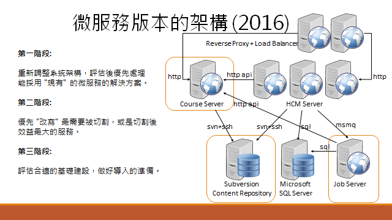

<!--more-->



--

前情提要: [架構師觀點 - 轉移到微服務架構的經驗分享 (Part 1)](/2017/04/15/microservice8-case-study/)

--

# 實際轉移案例

[上一篇](/2017/04/15/microservice8-case-study/)講到: 轉移到微服務架構是有條件的，基本門檻還達不到的話就貿然轉移到微服務
架構是很冒險的。微服務架構先天就較複雜，在開發、部署及維運這三個部份的要求都比單體式架構的 APP 來的高。因此我過去的經驗中，
我是採取比較保守的策略在做這件事。什麼叫 "保守"? 意思是我會先花很多時間研究及了解微服務架構的優缺點，也會花時間逐一進行 POC 
驗證每個改變的環節是否都能順利進行，而不是貿然的就把既有的服務整個打掉重練。

因此，我把既有的服務架構作了規劃，安排如何一步一步地進行微服務化。許多微服務化的架構建議我並沒有採用，因為我們的服務規模
還不夠大，投入在這些環節上，短時間只會造成困擾，而不會有具體的改善，這類狀況我只要確保現在的架構不會成為將來進一步改進的
阻礙就可以了。

在開始之前，先來看看我面臨的舊架構系統概況跟規模吧! 我試著盡量具體的量化 "規模" :

之前改造的服務，是人資領域相關的系統，用於數位學習及人才發展的管理。這類系統的特色就是表單特多，流程複雜。這系統的特性造成
程式碼之間的耦合度過高，維護的成本居高不下，因此降低維護的複雜度是主要目標。另外，這系統需要同時提供單機版本的
建置 (private cloud), 同時也提供雲端服務及代管模式 (SaaS, public cloud)。讓軟體架構同時適應這兩種 hosting 環境也是改版
的目標之一。

接著來看看改變之前的系統架構圖吧! 基本上就是很傳統，WEB + DB 的典型架構。其中 business logic 雖然有適當的切割 (用 library 的型態)，
但是在執行期間仍然是被放在同一個 process，部署的架構上並沒有明確的將之獨立出來。除此之外，因為系統包含數位學習，需要管理大量的
教材內容，因此多了 storage service 與 content server 的延伸架構。

各位可以想像一下，這狀況其實完全命中了微服務架構想解決的問題點啊! 這麼大規模的 code base, 改了任何一行就需要整個服務重新部署，
我們在這樣的基礎上導入了 CI / CD, 但是冗長的編譯時間也導致 CI / CD 的作用大打折扣。另外，商業邏輯也包含在 WEB 內，任何一個
模組失效 (如 out of memory exception 等等) ，都會導致整個系統掛掉...。

在當時，我歸納了整個系統架構上有四項主要的問題等著被解決:

即使如此，微服務架構仍然不是萬靈丹，因為前面有提到，微服務架構是有進入門檻與代價的啊! 經過評估之後，我們決定按照實際問題的影響程度，
逐步進行改善。對我們當時的狀況而言，最優先處理的是 **維護困難**、還有 **雲端化困難** 這兩項。而 **部署困難** 則是緊接著雲端化
問題解決後緊接著會面臨的問題，因此也一併考慮在內。因此我們著手進行微服務化架構的改進，切割的策略及進行順序都按照這重要性來安排。

回顧這決策的過程，我覺得[這篇文章: 一窩蜂驅動開發](https://blog.chunfuchao.com/?p=656&variant=zh-tw)最能描述我當時的心境了! 
這是在事後才讀到的文章，不過這篇文章講的內容完全就是我當初思考的啊! 不分享不行，我特地花了點篇幅來介紹這篇文章要講的內容...

# 一窩蜂驅動開發!!

原文: [一窩蜂驅動開發](https://blog.chunfuchao.com/?p=656&variant=zh-tw)  

我只能說，這篇文章講的實在太傳神，太到位了! 甚至文內舉了幾個常見的例子，就包含了微服務架構 XD，根本完全命中我擔心的狀況啊...

其實多看看別人的解決方案，多看看新的技術，並不是壞事。糟糕的地方在於對自己過度自信，聽到很棒的新技術就相信自己能 100% 駕馭，
不顧後果的就往前衝，往往會讓自己 (及團隊) 陷入進退兩難的困境。通常會陷入這種 "一窩蜂" 的困境的人，都有幾種特質:

1. 好奇心強，喜歡新的技術
1. 高度自信，認為自己無所不能，或是高估團隊的能力
1. 過度樂觀，缺乏替代計畫
1. 過於躁進，未做仔細評估就決定執行
1. 過於熱血，追求新技術的衝動，遠高於解決問題的企圖

其實，這幾個特色並不算是缺點，甚至很多成功的人都會有這些特質。有往前進的動力是很好的，危險的是過於衝動及躁進的態度，沒有搭配
良好的執行計畫，才是致命傷啊! 過程我就不多說，文章裡面其實已經講得很精采了 XDD，我針對主題 (導入微服務架構) 拉回來討論:

前面才說到，微服務架構的進入門檻是很高的，這點會讓過度樂觀的人更容易掉入陷阱。我如果早個五年經歷這些事情，我可能會毅然決然的
決定把整個架構砍掉重練 (Orz, 中槍)。不過現在的經驗告訴我，沒事千萬別丟掉現有的 source code 從頭改寫。舊的 code 再怎麼不堪，
至少它的邏輯是符合使用者期待的，只是可能會伴隨著很糟的效能、很差勁的可靠度... 等。用新的架構改寫，的確可以一勞永逸的解決這些問題，
不過所有的系統開發案都一樣，你終究需要一段時間，不斷的經歷測試->修正->測試... 的循環，bugs 才會逐漸下降，系統的品質才會逐步
提高到可接受的水準。砍掉重練的話這部分是很難速成的啊! 這時不論解決了多少其他問題，你的新系統終究無法立即上線，專案終究必須
度過很長的一段黑暗期... 

因此我採納了其他微服務的大師及成功案例的作法，改採 "重構" 的策略，逐步的把系統調整成微服務架構。並且在那之前，我花了不少時間，
針對我有興趣的技術，做了各種 POC 及驗證，先用最短的時間，確認這些技術真的能夠解決我們面臨的主要問題。

這正好符合這篇文章講到的幾點避免陷入一窩蜂的做法:

* 快速測試 (Spikes) - 我做了非常多的小型 POC，每個都是針對我最在意的問題，寫一段驗證的 code, 確保過程跟我想像的是一致的，真的
能解決問題才結束。以我的例子來說，對我們的系統及團隊來說，微服務化我最在意的是 API 的相容性怎麼維持? 拆解成大量服務的話怎麼
解決部署的問題? 熱門的容器化技術，是否能對我們這種 pure .net develop team 發揮功效? 過程中我甚至花了一個禮拜，把其中一個小模組
親自改寫成微服務架構 + 容器化部署，包含 web api, sdk, 以及 schedule job 等部分，都改成用 windows container + asp.net mvc
webapi 來實作。這部分的過程，我會在之後另外寫一篇文章介紹過程跟心得。

* 在投資報酬率很高的時候下手 - 書上講的 guidelines 有很多條，但是不是每條都對我的現況有幫助。我花了不少時間了解每條指引準則，
是為了解決甚麼問題? 同時檢視看看這問題是否是最困擾我們的問題? 重新思考及排序之後，我優先挑選對我們幫助最大的幾點做準備及改善。
而非清一色無腦的照著書上講的方式來進行。

* 經驗 + 有札實技術背景的人 - 這... 容我自誇一下... 哈哈，整個過程我最自豪的地方，就是過去學了那麼多 OOP，Design Patterns, 還有
一堆軟體工程的知識及技巧，終於派上用場了! 在單純專案開發，或是功能開發的階段，這些流程或是軟工領域的技能常常會被忽略，但是在碰到
這種架構層面的改變時，我過去累積的這些能力就幫了我很大的忙。

不說別的，光是重構的技巧 + 單元測試的觀念，就讓我閃開不少地雷，切割微服務的過程中順利許多。表面上我好像浪費了很多時間在做改 code
以外的事情 (如 POC，花時間先整理 Code，寫測試，同時比對新舊架構執行結果等等)，但是換來的好處是整個過程都很可靠很平穩地進行。
雖然不見得是最快速度，但是是風險最低的做法，同時過程中隨時都能維持可出貨可使用的狀態。這些都要歸功過去累積的知識及經驗。

奉勸各位 (尤其是技術決策者)，看到我寫的這系列微服務架構的文章，千萬別太興奮就想要你的團隊一頭衝進來啊! 做這種事情，最關鍵的
角色就是團隊裡要有個稱職的架構師。架構師最重要的職責，就是負責平衡整個系統的各個環節。就如同 "木桶效應" 講的一樣，整個系統的
效能，取決於最弱的那一環；就如同木桶能裝多少水，取決於最短的那片木頭。微服務架構，其實是過去十幾年來，分散式系統與雲端服務等等
技術的縮影，架構上的複雜度是很高的，因此要適度借重各種既有的服務、元件、基礎建設來降低使用微服務架構的門檻。但是要能熟練地運用
這麼多東西，如何挑選及組合，就是最重要的事情了。

經驗不足的 tech leader, 往往會高估團隊對技術的掌握能力, 貿然採用無法掌握的架構時，就會發生這篇文章描述的狀況 XD... 這時你
能做的，就是先做好各種事前驗證 (POC)，盡早掌握這技術架構的可行性，還有盡早掌握可能面臨的風險在哪裡。如果要失敗，那就在 POC 先
失敗吧! 很多軟體工程的方法論鼓吹 Fast Fail 的道理就在這裡。

稱職的架構師，除了挑選及規劃架構的能力之外，至少要具備良好的 coding 的能力，要好到什麼程度? 要能把你腦袋中想像的解決方案，實際
用 code 把核心部分寫出來，同時盡可能簡化或是略過非必要的部分。這能力至關重要，因為這是架構師如何能跟團隊溝通的重要工具。對外，
你可以用這樣的技能做出 POC，跟老闆與客戶證明你的構想與架構是可行的，對內，你則能給團隊信心，同時取得團隊對你的信任，眼見為憑，
工程師們眼裡只有 code, 只有親眼看到你能寫出 code 證明你的概念可行，才會相信你後面的判斷及規劃。

架構師要有足夠的 coding 能力，原因就在這裡。這一切對團隊的幫助，都不是其他外部的 coding 高手，或是外面請來的技術顧問能夠取代的。
擁有這能力，架構師就能用工程師共通的語言 - source code, 跟團隊其他技術人員溝通，也能透過 source code 指導團隊其他成員。
這種事只要你經歷過就知道，再多的文件，都不如一段真的可執行的 source code 來的實際, 可以讓你底下的工程師了解你到底要表達什麼。

想了解架構師到底要做什麼，可以參考這幾篇，講得很到位:

* [軟件架構師是什麼？他們應該寫代碼嗎？](http://blog.palapple.com/2014/02/blog-post_3.html)
* [2014-09-11 如何培養架構性思考 (談軟體架構師必經之路) - 投影片分享](https://dotblogs.com.tw/gelis/2014/09/11/146512)
* [是什麼讓軟體架構師成功？](http://teddy-chen-tw.blogspot.tw/2016/07/blog-post_27.html)

因此，如果你們家的 architect 是不寫 code 的 (不管是不會寫，還是不想寫都一樣)，那麼上面講的事情，他應該一件都做不到... 你就別
指望他能做好這件事了。很多管理的文章也都講到，主管不肯親自動手做，不肯把手弄髒，是無法做好事情的。這句話套用到架構師身上也適用。

團隊裡有一位好的架構師是很重要的，沒有的話快點去找一個 XD

補個我常被問到的問題: 

有人問我，若團隊內沒有架構師，能否聘請技術顧問來取代?

> 我的答案是: 能找到有同等能力的技術顧問，當然是件好事。不過我判斷的標準也一樣，外部顧問如果只是出一張嘴，還有只是產出一堆文件
> 跟規劃，但是一行 code 都寫不出來的話，那對團隊一樣是沒有幫助的。技術顧問如果只顧不問，沒有跟團隊一起深入了解問題的根源找出
> 解決方案，那也是徒勞無功。如果你不確定顧問是否符合你的期望，也可以試試在正式合作前，先從小的案子，或是企業內訓等等方式開始合作，
> 從中觀察就可以得知。

雖然在執行這改版計畫時，我的身分是 CTO，是管理職，不過在這過程中我同時身兼 Architect (當然是很愛寫 code 的那一種), 才順利的
跨過微服務的門檻 (不然也就不會有這麼多篇文章了)

# 回到微服務化，我們最後做了那些改變?

一窩蜂完畢，回到主題: 微服務化。回頭來看看我面臨到的問題與當時的系統架構，還有我對新架構的期望。原本的架構我再重貼一次:

典型的 WEB + DB 架構，WEB 可以 scale out, 配合數位學習有大量內容管理需要，後端搭配 file server，與類似 CDN 的分散式部署
方式 (file sync based) 來解決流量問題。

這樣的架構其實蠻落伍了，最大的問題在於，這架構的思維完全是早期企業內部的網路架構，完全是 intranet based 的思維設計出來的架構。
其實這也沒什麼不對，因為這是 2000 年就規劃出來的架構啊 XD (是，也是我設計的... Orz)。這樣的架構最大的缺點就是 CP 值很低，所有
關鍵的環節都是自己來，建置與維護成本很高。雲端時代的優勢完全沒有用到啊，廣大的 open source 資源也沒用到啊，更別提微服務架構了..

過程中其實我想過很多符合 "熱門" 技術下的架構規劃，不過都被我自己否決了，因為我發現我自己陷入了一窩蜂的坑了啊... 後來我重新思考
熱門技術到底能帶給我甚麼優勢? 我才逐漸掌握到我需要的架構是什麼。我先歸納這幾點，後面再逐一說明:

1. 服務的細粒度要夠高 - 慎選既有系統的切割方式
1. 部署方式要夠靈活 - 能同時適應企業內部環境，也能適應混合雲 (public cloud + private cloud) 的環境
1. 要能充分運用 cloud service 的特性，包含 public cloud 無窮盡的運算資源，也要考慮 cloud service 的商業及營運模式

這裡每一項拆開都可以再寫個一兩篇文章 @@，我先跳到結論，等等再回頭探討:

這是我初步規劃，調整後的架構。主要的改變有幾個地方:

1. content service 從單純的 CDN 升級為 course server:
除了負責在適合的節點傳遞數位內容之外，也把學習過程中需要的內容傳遞，內容加密，認證授權，學習行為追蹤等等機制都集中到這裡來了。這點是配合微服務架構指南裡的這條: Single-Responsibility Principle。其實這也不是微服務才有的觀念... 軟體開發的概念自古就這樣講了..
順手貼個 2011 的文章: [亂談軟體設計（3）：Single-Responsibility Principle](http://teddy-chen-tw.blogspot.tw/2011/12/3.html)

這就呼應到前面提到的 "高內聚 + 低耦合"，我不只想解決教材傳遞的頻寬問題，我想解決的是所有管理教材，提供教材服務所需要的功能，都應該搬到
content service 才合理。

1. 採用 subversion 來取代原有的 file server。
教材的儲存管理，有很多難題，包括:
- 教材的版本控制 (過去就是目錄結構，切一層出來當作版本號碼，每個目錄都有一份該版本完整教材檔案，管理不易，且儲存空間使用效率很低)
- 教材的同步 (過去採用 IT 的各種 file sync solution, robocopy, dfs... etc, 資安問題與效能很頭痛)
- 教材庫的維護 (結構檢查，一致性檢查，結構修復，備份，還原等等都得自己來)
我本來想找些其他分散式檔案系統來解決這問題，不過看來看去都有點殺雞用牛刀的感覺... 直到某天，我才想到，為何不用 developer 最熟悉的
版控系統? 這時 subversion 變成我的首選。不用當紅的 git, 是因為 svn 集中式的架構更適合我的需求啊，svn 在運作模式上也更貼近我的
需求，同時他也發展得夠久夠可靠了。只是單純的挑當紅的 git, 其實對我並沒有甚麼幫助。

1. 採用 message queue 取代過去都靠 share database 很兩光的跨服務溝通機制。share database 除了有一狗票的缺點之外, RDBMS 難以
擴充也是將來瓶頸之一。更糟糕的是 share database 通常只能被動地 query database, 無法主動的 push notification, 改用 message queue
可以有效的改善這些限制。

1. 也因為 message queue, 基礎的通訊機制大幅提升之後，過去只能靠 windows task scheduler (對比 linux 的 corn table) 排定
工作才能解決的問題，現在可以更精確地靠 message 來觸發 jobs 了。更大型的任務 (如 video encoding) 也開始可以很有效率地放在這邊
執行。跨越 IDC 的教材同步，也可以不再需要依賴排程在半夜執行，只要教材部署完畢就可立刻觸發執行單份教材的同步作業

1. 其他 microservices 慣用的 infrastructure, 例如 reverse proxy 等等我就不多作介紹，這邊就直接沿用。

以上這些調整，最終的成果就是這張系統架構圖了。你會發現，很多微服務架構指南提到的準則，我並沒有每一條都照表操課。我只挑選真正對我們
團隊有足夠的效益，我才採納。其他價值不是那麼高的設計，我就放在心裡，隨時優化系統，只要做好準備，將來需要時可以用最快速度重構就可以了。

微服務: 雲端化 (cloud native) 的經驗累積形成的架構指南
https://insidethecpu.com/2015/05/22/microservices-with-c-and-rabbitmq/
